# 🖥 Health-InfraOps
**Healthcare Infrastructure & Operations Simulation for e-Clinic / e-Puskesmas System**

<p align="center">
  
  
  
  
  
</p>

<p align="center">
  
  
  
</p>

## 🩺 Project Overview

**Health-InfraOps** adalah platform infrastruktur terintegrasi untuk simulasi lingkungan produksi layanan kesehatan digital (e-Clinic/e-Puskesmas). Dirancang sebagai portofolio project System Administrator/InfraOps/DevOps Engineer dengan fokus pada:

- 🏥 **Healthcare Compliance** - HIPAA/GDPR compliant infrastructure
- 🚀 **High Availability** - Multi-tier architecture dengan load balancing
- 🔒 **Security First** - Zero-trust architecture dengan encrypted communication
- 📊 **Comprehensive Monitoring** - Real-time monitoring dan alerting
- 💾 **Disaster Recovery** - Automated backup dan recovery procedures
- 🤖 **Infrastructure as Code** - Automated provisioning dan deployment

## 🏗️ Architecture Overview```mermaid


### Network Segmentation
- **VLAN10 (192.168.10.0/24)** - DMZ Network (Public facing services)
- **VLAN20 (192.168.20.0/24)** - Application Network (Internal applications)
- **VLAN30 (192.168.30.0/24)** - Database Network (Database servers)
- **VLAN40 (192.168.40.0/24)** - Management Network (Administration)
- **VLAN50 (192.168.50.0/24)** - Backup Network (Storage/Backup)

## 🛠️ Tech Stack & Components

### Virtualization & Infrastructure
| Layer | Technology |
|-------|------------|
| **Hypervisor** | Proxmox VE, VMware, VirtualBox, Hyper-V |
| **Operating Systems** | Ubuntu 22.04 LTS, CentOS 9, Debian 12 |
| **Containerization** | Docker, Docker Compose |
| **Infrastructure as Code** | Terraform, Ansible, Packer |

### Application & Services
| Component | Technology |
|-----------|------------|
| **Web Servers** | Nginx, Apache HTTPD |
| **Application Runtime** | Node.js, Python, PM2, Gunicorn |
| **Databases** | MySQL Cluster, MongoDB ReplicaSet, Redis |
| **Message Queue** | RabbitMQ, Celery |

### Monitoring & Observability
| Component | Technology |
|-----------|------------|
| **Metrics** | Prometheus, Node Exporter |
| **Visualization** | Grafana, Kibana |
| **Logging** | ELK Stack, Loki Stack |
| **Alerting** | Alertmanager, PagerDuty integration |

### Security & Compliance
| Component | Technology |
|-----------|------------|
| **Network Security** | iptables, UFW, Firewalld |
| **Access Control** | SSH Key Management, Bastion Host |
| **Certificate Management** | Let's Encrypt, OpenSSL |
| **Audit & Compliance** | Lynis, Auditd, Fail2Ban |

## 📁 Project Structure

```mermaid
flowchart TD

    root["📁 health-infraops/"]

    %% infrastructure
    root --> infra["📁 infrastructure/ — Virtualization & Hypervisor configs"]
    infra --> infra1["📁 proxmox/ — Proxmox VE configurations"]
    infra --> infra2["📁 vmware/ — VMware vSphere configurations"]
    infra --> infra3["📁 virtualbox/ — VirtualBox/Vagrant configurations"]
    infra --> infra4["📁 hyper-v/ — Microsoft Hyper-V configurations"]

    %% servers
    root --> servers["📁 servers/ — Server configurations"]
    servers --> s1["📁 web-servers/ — Nginx, Apache configurations"]
    servers --> s2["📁 app-servers/ — Node.js, Python apps"]
    servers --> s3["📁 database/ — MySQL, MongoDB configurations"]
    servers --> s4["📁 monitoring/ — Prometheus, Grafana, Zabbix"]
    servers --> s5["📁 storage/ — Ceph, NFS configurations"]

    %% networking
    root --> net["📁 networking/ — Network infrastructure"]
    net --> net1["📁 firewall/ — iptables, UFW, Firewalld"]
    net --> net2["📁 load-balancer/ — HAProxy, Nginx LB"]
    net --> net3["📁 dns/ — Bind9, Dnsmasq"]

    %% security
    root --> sec["📁 security/ — Security configurations"]
    sec --> sec1["📁 ssl-certificates/ — TLS/SSL management"]
    sec --> sec2["📁 ssh/ — SSH configurations"]
    sec --> sec3["📁 audit/ — Security auditing"]

    %% automation
    root --> auto["📁 automation/ — Infrastructure as Code"]
    auto --> a1["📁 ansible/ — Playbooks & roles"]
    auto --> a2["📁 terraform/ — Terraform modules"]
    auto --> a3["📁 scripts/ — Deployment & management scripts"]

    %% documentation
    root --> docs["📁 documentation/ — Comprehensive documentation"]
    docs --> d1["📁 architecture/"]
    docs --> d2["📁 procedures/"]
    docs --> d3["📁 compliance/"]

    %% backups
    root --> backups["📁 backups/ — Backup & recovery"]
    backups --> b1["📁 scripts/ — Backup scripts"]
    backups --> b2["📁 schedules/ — Cron schedules"]
    backups --> b3["📁 recovery/ — Recovery procedures"]

    %% logs
    root --> logs["📁 logs/ — Log management"]
    logs --> l1["📁 centralized/ — ELK / Loki"]
    logs --> l2["📁 rotation/ — Log rotation configs"]

    %% monitoring dashboards
    root --> moni["📁 monitoring-dashboards/ — Monitoring & dashboards"]
    moni --> m1["📁 prometheus-alerts/ — Alert rules"]
    moni --> m2["📁 grafana-dashboards/ — Dashboards"]
    moni --> m3["📁 custom-metrics/ — App metrics"]

    %% root script
    root --> setup["📄 setup-environment.sh — Quick setup script"]
```



## ⚡ Quick Start

### Prerequisites
- **Linux/Windows/macOS** with virtualization support
- **8GB+ RAM**, **50GB+ free disk space**
- **Git** and basic command line knowledge

### Local Development Setup

#### 🐧 Linux/macOS
```bash
# Clone repository
git clone https://github.com/ekpurwanto/health-infraops.git
cd health-infraops

# Run setup script
chmod +x setup-environment.sh
./setup-environment.sh

# Activate virtual environment
source venv/bin/activate

# Test deployment
./scripts/deploy.sh local infrastructure --dry-run

🪟 Windows PowerShell 
# Clone repository
git clone https://github.com/ekpurwanto/health-infraops.git
cd health-infraops

# Run setup script (as non-admin)
Set-ExecutionPolicy -ExecutionPolicy RemoteSigned -Scope CurrentUser
.\setup-environment.ps1

# Activate virtual environment
.\venv\Scripts\Activate.ps1

# Test deployment
.\scripts\deploy.ps1 -Environment local -Component infrastructure -DryRun


## Production Simulation
# Deploy full infrastructure
./scripts/deploy.sh production all

# Run health checks
./scripts/health-check.sh --environment production --full

# Test backup procedures
./scripts/backup-all.sh --environment production --type full --verify

🚀 Key Features
🔄 Automated Deployment
# Deploy specific components
./scripts/deploy.sh production infrastructure
./scripts/deploy.sh production database
./scripts/deploy.sh production monitoring

# Dry-run mode for testing
./scripts/deploy.sh staging all --dry-run


🩺 Health Monitoring
# Comprehensive health checks
./scripts/health-check.sh --environment production --full

# Quick status check
./scripts/health-check.sh --environment production --quick

# Component-specific checks
./scripts/health-check.sh --environment production --component database

💾 Backup & Recovery
# Full backup with encryption
./scripts/backup-all.sh --environment production --type full --encrypt --verify

# Incremental backup
./scripts/backup-all.sh --environment production --type incremental

# Disaster recovery test
./scripts/disaster-recovery.sh failover production


📊 Monitoring & Alerting
 - Real-time metrics dengan Prometheus

 - Custom dashboards di Grafana

 - Multi-channel alerts (Slack, Email, PagerDuty)

 - Business metrics untuk healthcare compliance


🏥 Healthcare Compliance Features
HIPAA Compliance
 - ✅ Encrypted data at rest dan in transit

 - ✅ Audit trails untuk semua access

 - ✅ Role-based access control

 - ✅ Automated security scanning

 - ✅ Data backup dan recovery procedures

Data Protection
 - 🔒 End-to-end encryption

 - 🔒 Secure key management

 - 🔒 Network segmentation

 - 🔒 Regular security assessments


📈 Monitoring & Metrics
Infrastructure Metrics
 - CPU, Memory, Disk utilization

 - Network traffic dan error rates

 - Service availability dan response times

 - Database performance metrics

Application Metrics
- API response times dan error rates

- Business transaction metrics

- Patient data processing metrics

- Healthcare compliance metrics

Business Metrics
- Patient records processed

- Medical record synchronization status

- Appointment scheduling performance

- System uptime dan availability

🧪 Testing & Validation
Load Testing
# Run performance tests
./scripts/performance-test.sh --environment staging --users 100 --duration 300

# Stress testing
./scripts/stress-test.sh --component database --duration 600

Security Testing
# Vulnerability assessment
./security/audit/lynis/lynis-audit.sh

# Network security scanning
./security/audit/network-scan.sh


Disaster Recovery Testing
# Full DR test
./scripts/disaster-recovery.sh validate-dr --environment production

# Failover simulation
./scripts/disaster-recovery.sh failover --dry-run


🔧 Configuration Management
Environment Configuration
# Environment variables
cp .env.example .env
# Edit .env dengan configuration settings

# Ansible inventory
vim automation/ansible/inventory/production

# Terraform variables
vim automation/terraform/environments/prod/terraform.tfvars


Customization
 - Modify servers/ untuk application-specific configurations

 - Update networking/ untuk network architecture changes

 - Adjust monitoring-dashboards/ untuk custom metrics

 - Extend automation/ untuk additional provisioning needs


🤝 Contributing
Development Workflow
1. Fork repository

2. Create feature branch
    git checkout -b feature/your-feature

3. Make changes dan test
    ./scripts/health-check.sh --environment local --full

4. Commit changes
    ./scripts/git-push.sh -m "Add your feature description"

5. Create Pull Request

Code Standards
 - Shell scripts: ShellCheck compliant

 - Python code: PEP 8 style guide

 - Documentation: Markdown format

 - Security: No hardcoded credentials

📚 Documentation
Quick Links
 - 📋 Infrastructure Overview

 - 🚀 Deployment Guide

 - 🔒 Security Policy

 - 💾 Backup Procedures

Additional Resources
Architecture Diagrams

Operational Procedures

Compliance Documentation

🐛 Troubleshooting
Common Issues
# Check service status
./scripts/health-check.sh --environment local --quick

# View logs
tail -f logs/health-infraops.log

# Verify configurations
./scripts/verify-configurations.sh


Getting Help
Check Troubleshooting Guide

Review existing GitHub Issues

Create new issue dengan detailed description

📄 License
This project is licensed under the MIT License - see the LICENSE file for details.

<div align="center">
🏆 Professional Infrastructure Portfolio
"Demonstrating enterprise-grade healthcare infrastructure management capabilities"

⭐ Star this repo jika project ini membantu Anda!

</div>
